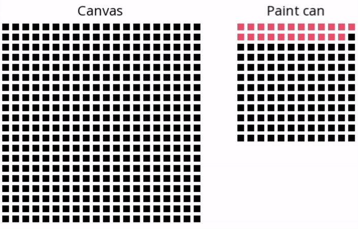

# Тестовое задание "Читатели-писатели"
## Задание
Необходимо реализовать схему взаимодействия процессов «читатели-писатели» под ОС Windows с использованием соответствующих
системных вызовов WinAPI и многопоточности, используя thread, event, и mutex. Приоритет может быть любым. Потоки должны разделять
общее адресное пространство. Количество читателей, писателей, повторов программы, а также временные задержки, задаются
директивами препроцессора. Обеспечить вывод на экран результат работы читателей и писателей.

## Реализация

В реализации используются две матрицы. Одна матрица (paint) используется объектами PaintReader и PaintWriter, вторая (canvas)
-- только PaintReader. В paint может одновременно писать только один из объектов PaintWriter. Пока идет запись все остальные 
объекты ожидают своей очереди. Как только запись закончилась, объекты PaintReader считывают значение цвета из paint и красят
этим цветом одну из ячеек в canvas, затем снова пытаются считать цвет из paint для закрашивания следующей ячейки. Так как
последовательность обращения потоков к матрице paint недерминировано, то после каждого запуска мы ожидаем различную раскраску
canvas. Каждую ячейку в canvas закрашивает только один заранее определенный объект PaintReader.

Платформо-зависимый код для работы с потоками вынесен в отдельный файл. Таким образом, в теории перенос реализации на другую
платформу может быть выполнен без внесения изменений в файлы модели и GUI. 